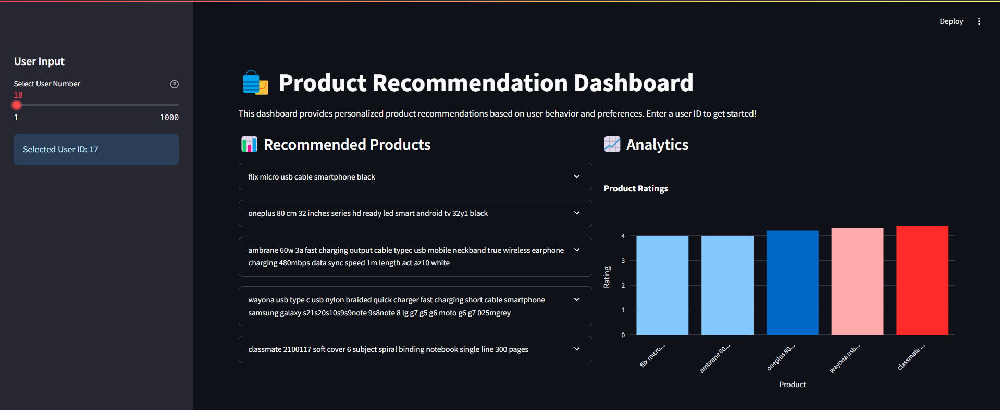
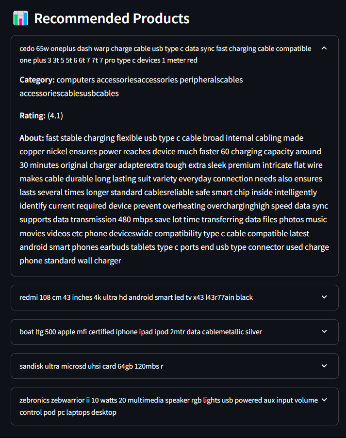
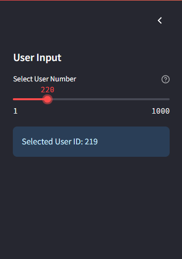
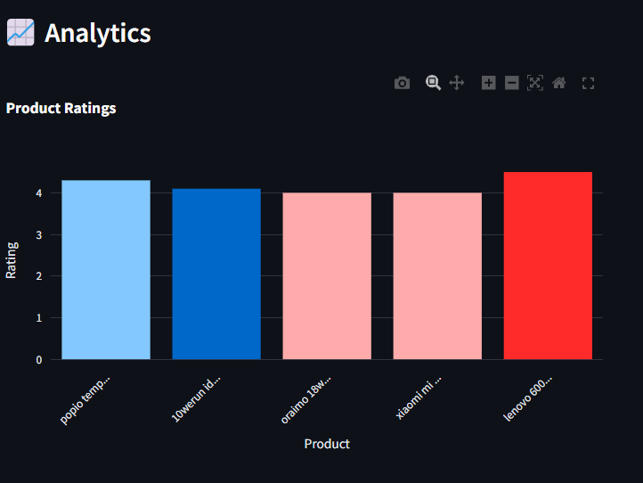

# Overview
A hybrid recommendation system that combines content-based and collaborative filtering approaches to provide personalized product recommendations. The system analyzes product details, user ratings, and review data to suggest relevant items to users.

# Usage
### Step 1
You can clone this repository locally using CLI or download it as a zip file.
```bash
git clone https://github.com/Aakarsh204/Recommender-System.git
```
### Step 2
To run the Streamlit App Dashboard, you need to create an Anaconda environment
```bash
conda create --name Recommender-System --file requirements.txt
```
This will install all the dependencies that you require to get started.
### Step 3
After they have finished installation, download the Collaborative Filter Model and Content Based Similarity Matrix from my GDrive

[Link to Cosine Matrix](https://drive.google.com/file/d/1p0amjkWk1sLZMDGaWbb-e4X8jxUZIFjL/view?usp=drive_link)

[Link to CF Model](https://drive.google.com/file/d/1HbEL57Lw5DL3Ug-gckgjqvllQutZZSWP/view?usp=drive_link)

Extract the models to the main working directory

Also extract the python scripts to the main working directory
### Step 4
Download the dataset from this [link](https://www.kaggle.com/datasets/karkavelrajaj/amazon-sales-dataset)

Extract this to the main working directory as well. So far your workspace should look like this:
```
Recommender-System
 |
 +-- cfmodel.pkl
 |    
 +-- cosine_matrix.npz
 |    
 +-- amazon.csv
 |    
 +-- requirements.txt
 |    
 +-- app.py
 |
 .... Rest of your scripts
                  
```
### Step 5
Once you are done setting up, activate your conda environment
```bash
conda activate Recommender-System
```
Now inside the environment, run this command
```bash
streamlit run app.py
```
This should start up the streamlit app in your local browser.
Happy Shopping!


# Features
- Content-based filtering using product details and reviews
- Collaborative filtering using user-item interactions
- Hybrid recommendation approach combining both methods
- Extensive data preprocessing and cleaning
- Detailed exploratory data analysis (EDA)
- Performance evaluation metrics
- Interactive Dashboard with streamlit to generate recommendations based on user-id

# Dataset
The system uses an Amazon Sales Dataset with the following key features:
- Product information (ID, name, category, price [actual and discounted])
- User reviews and ratings
- Product descriptions
- Category hierarchies


# Technical Details

## Dependencies
```python
pandas
numpy
matplotlib
seaborn
scipy
scikit-learn
nltk
surprise
streamlit
plotly
```

## Data Preprocessing
- Text cleaning and normalization
- Handling missing values
- Price formatting
- Category hierarchy splitting
- Rating weight calculation
- Label encoding for user and product IDs

## Recommendation Approaches

### Content-Based Filtering
- Used TF-IDF vectorization for product details
- Computed cosine similarity between products
- Recommended products based on item-item similarity

### Collaborative Filtering
- Implemented SVD (Singular Value Decomposition)
- Used the Surprise library for model training
- Cross-validation for model evaluation

### Hybrid System
- Combines content-based and collaborative filtering scores
- Weighted recommendation scores
- Configurable weights for each approach

## Performance Metrics
- RMSE (Root Mean Square Error)
- MAE (Mean Absolute Error)
- Average Precision Score

# Challenges
- The dataset had a unique format, where each product had comma separated user values
- Splitting the user values often led to many predictions being the same item, but from different users
- Going from experimenting in Colab to modularizing the code
- Debugging the errors in the streamlit dashboard

# Screenshots




